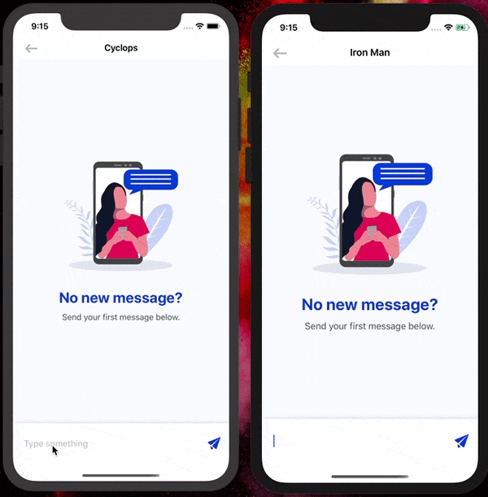

# iOS Chat App With a Typing Indicator

Read the full tutorial here:

[**>> How to Add a Typing Indicator to Your iOS Chat App**](TODO)

This example shows how to build an anonymous group chat app with a typing indciator in Swift:

## Technology

This demo uses:

* CometChatPro 2.0.7
* Swift 5
* Xcode 11.3.1 or higher

## Running the demo

To run the demo follow these steps:

1. [Head to CometChat Pro and create an account](https://cometchat.com/pro?utm_source=github&utm_medium=example-code-readme).
2. From the [dashboard](https://app.cometchat.com/?utm_source=github&utm_medium=example-code-readme), create a new app called "CometChat" in **USA**.
3. Once created, click **Explore**.
4. Go to the **API Keys** tab and click **Create API Key**.
5. Create an API key called "Swift 1 on 1 Chat Key" with **Full Access**.
4. Download the repository [here](https://github.com/marinbenc/cometchat-ios-typing-indicator/archive/master.zip) or by cloning `https://github.com/marinbenc/cometchat-ios-typing-indicator.git`.
5. Navigate to project directory and use `pod install` command to install the pods and open **CometChat.xcworkspace** in Xcode.
6 Update the `Constants` in [ChatService.swift](https://github.com/marinbenc/cometchat-ios-typing-indicator/blob/master/CometChat/CometChat/Model/ChatService.swift) with your newly-created app ID, API key and Region code.
7. Run the app and login with one of the test users: superhero1, superhero2, superhero3, superhero4 or superhero5.

Questions about running the demo? [Open an issue](https://github.com/cometchat-pro-tutorials/TODO/issues). We're here to help ✌️

## Useful links

- 🏠 [CometChat Homepage](https://cometchat.com/pro?utm_source=github&utm_medium=example-code-readme)
- 🚀 [Create your free account](https://app.cometchat.com?utm_source=github&utm_medium=example-code-readme)
- 📚 [Documentation](https://prodocs.cometchat.com/docs?utm_source=github&utm_medium=example-code-readme)
- 👾 [GitHub](https://github.com/CometChat-Pro)

